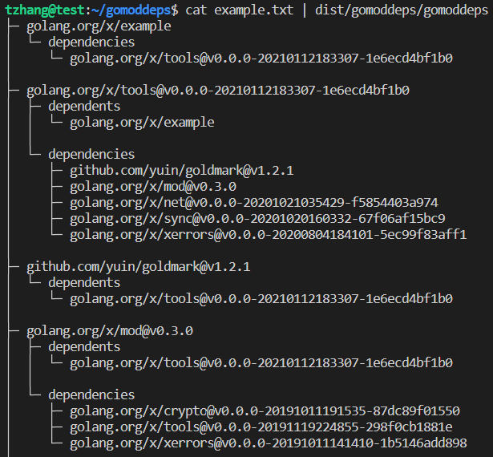
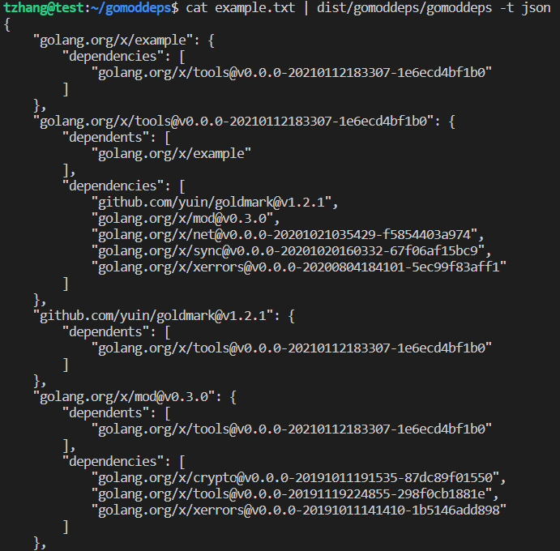
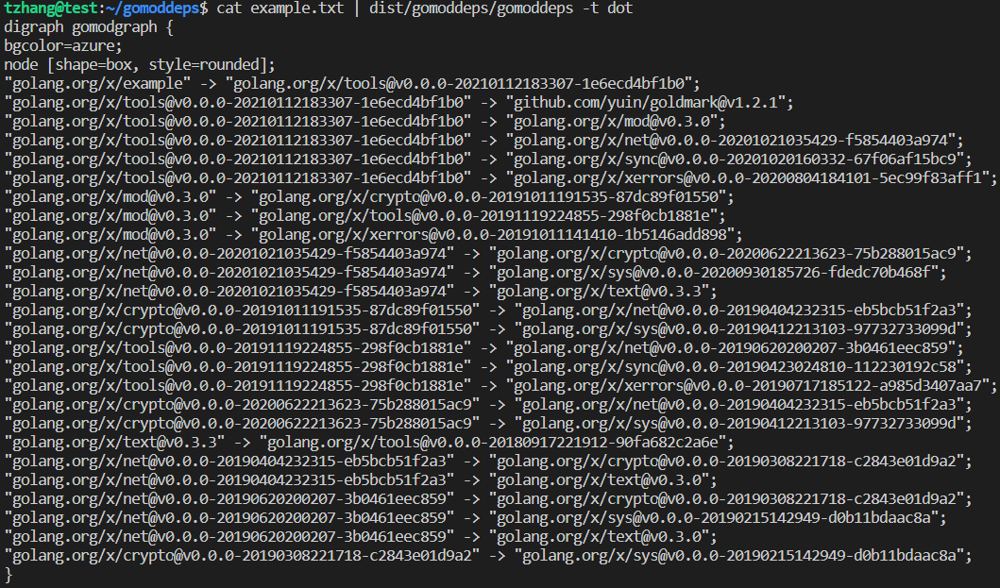
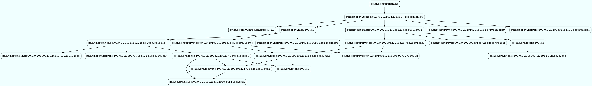
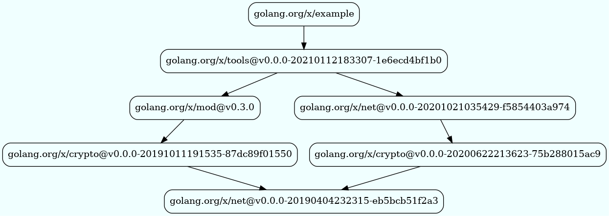
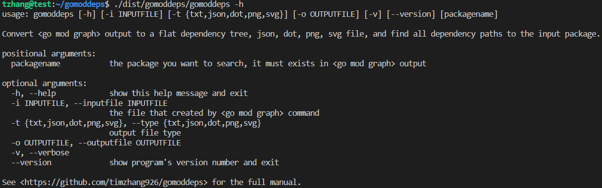

# go-mod-deps

# Go Mod Dependency Tree

## Why
For any Go project, a list of Go packages are reused. These packages have complicated dependencies between them, which can be difficult to keep track of. To help with this, the Go Mod Graph command provides a way to view these dependencies and show the relationships between the packages recursively. This can be useful to understand the full picture of the dependencies, however the output of the go mod graph can be difficult to comprehend. 

* To make it easier to understand, a flat dependencies tree can be used to visualize the graph and make it easier to understand the relationships between the packages.

* If a package is found to have vulnerabilities or is at the end of its maintenance cycle, it can be difficult to know which packages are impacted and should be upgraded. This is especially true in large systems with many interconnected packages. In these cases, it is important to have a tool in place to track the packages relationships, so that any potential issues can be identified and addressed quickly.

* The dependencies of a Go project form our supply chain, and we need to be aware of the software bill of materials. The output of the go mod graph command provides us with the initial information, but it is not easy to be processed by downstream pipelines. To address this issue, the JSON format is very useful.

* To gain a better understanding of the dependencies, it can be helpful to visualize them in a picture format. This could be done using a png or svg file, which can provide a clear and concise representation of the connections between the different components. Visualizing the dependencies in this way can help to quickly identify any potential issues or areas of improvement.

# Screenshots 
## Dependency tree

## Dependency tree in json

## Dependency tree in dot

## The big picture with all dependencies

## Subset picture with all paths to an Go package.

# Usage

